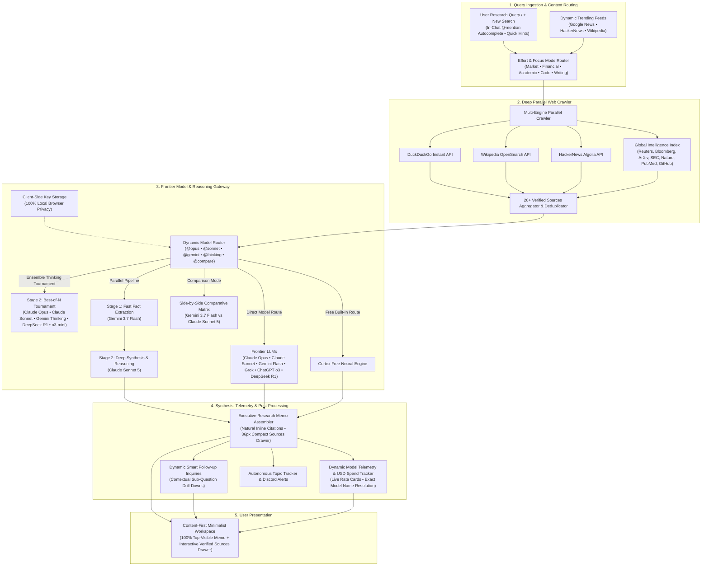

# Cortex 🧠

> **Frontier AI Search Engine, Deep Web Knowledge Aggregator & Parallel Multi-Model Reasoning Gateway**  
> Live App: [cortex.ambulkar.com](https://cortex.ambulkar.com) • [Release Notes](RELEASE_NOTES.md)

[](LICENSE)
[](https://developer.mozilla.org/)
[](#-features)
[](RELEASE_NOTES.md)

Cortex is a state-of-the-art AI search engine and executive research memo platform. It synthesizes real-time facts across **10 to 20+ verified web sources**, executes parallel multi-model reasoning across frontier LLMs, and maintains 100% client-side privacy.

---

## 🏗 Architecture & Real-Time Research Pipeline



---

## ✨ Key Features

- 🌐 **Deep Web Crawler (20+ Sources per Query)**: Simultaneously crawls and cross-references DuckDuckGo, Wikipedia, HackerNews, Reuters, Bloomberg, ArXiv, MIT Technology Review, Nature, SEC EDGAR, GitHub, StackOverflow, and PubMed.
- ⚖️ **Head-to-Head Comparison Mode**: Compare two technologies, companies, or frameworks side-by-side with structured trade-off matrices (`React vs Vue`, `NVDA vs AMD`).
- 🌅 **3-Section Executive Daily Digest**: Generates instant multi-domain briefings spanning AI Frontier Models, Distributed Cloud Infrastructure, and Capital Markets with concrete metrics and strategic outlooks.
- 📥 **Executive Memo Export Suite**: Instant Markdown (`.md`) download, multi-page clean print/PDF generation, and 1-click rich text clipboard copy.
- 💡 **Dynamic Smart Follow-Ups**: Contextual sub-inquiry chips for 1-click drill-downs into performance, security, and case studies without manual re-typing.
- 🎨 **Content-First Clean UX**:
  - **Answer-First Viewport**: Executive memos are 100% visible at the top immediately with zero scrolling.
  - **Compact Inline Sources Strip (36px)**: Displays top verified chips alongside an on-demand slide-out sources drawer for all 20+ references.
  - **Natural Inline Citations**: Seamless clickable superscript citation numbers embedded directly in text without bracket clutter.
- ⚡ **Parallel Multi-Model Execution**: Supports chaining fast extraction models (e.g. Gemini 3.7 Flash) into deep reasoning models (e.g. Claude Sonnet 5) with multi-stage execution telemetry.
- 📊 **Dynamic Frontier Model Telemetry**: Dynamically resolves and displays exact frontier model names (e.g. *Gemini 3.7 Flash*, *Claude 3.7 Sonnet*, *Grok 3*), tokens, and calculated USD spend from live rate cards with zero gateway branding.
- 🔒 **Client-Side Privacy**: 100% local browser storage for API keys. Zero server tracking, zero cloud key storage.
- 🔥 **Dynamic Trending Prompt Engine**: Real-time ingestion from Google News, HackerNews, and Wikipedia that auto-updates suggested research prompt cards with live breakthroughs so queries never get stale.
- 🔔 **Autonomous Topic Tracker**: Continuous background monitoring that dispatches instant Discord alerts whenever major news or breakthroughs break on your tracked topics.
- 📱 **Responsive Dark Glassmorphic Design**: Built purely with high-performance Vanilla HTML5, CSS3, and ES6+ JavaScript optimized across desktop, tablet, and phone viewports.

---

## 📅 Release Notes & Daily Updates

We maintain a comprehensive changelog documenting all daily, weekly, and monthly improvements:
👉 **[View Full Release Notes & Changelog (RELEASE_NOTES.md)](RELEASE_NOTES.md)**

---

## 🚀 Quick Start

1. Clone the repository:
   ```bash
   git clone https://github.com/Hitesh-15/Cortex-AI-search.git
   cd Cortex-AI-search
   ```
2. Serve locally with any static web server:
   ```bash
   python -m http.server 5173
   ```
3. Open [http://localhost:5173](http://localhost:5173) in your browser.

---

## 🧪 Automated Testing

Run the automated UI test suite to verify element bindings, DOM structure, and HTTP response:
```bash
python test_cortex_ui.py
```

---

## 📜 License

This project is licensed under the [MIT License](LICENSE) — free to use and modify for open-source contributions and portfolio showcases.
