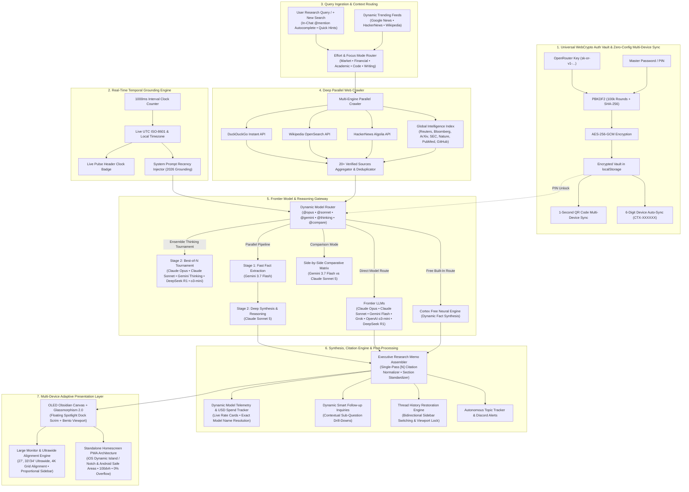

# Cortex 🧠

> **Frontier AI Search Engine, Deep Web Knowledge Aggregator & Parallel Multi-Model Reasoning Gateway**  
> Live App: [cortex.ambulkar.com](https://cortex.ambulkar.com) • [Release Notes](RELEASE_NOTES.md)

[](LICENSE)
[](https://developer.mozilla.org/)
[](#-features)
[](RELEASE_NOTES.md)

Cortex is a state-of-the-art AI search engine and executive research memo platform. It synthesizes real-time facts across **10 to 20+ verified web sources**, executes parallel multi-model reasoning across frontier LLMs (**Claude 3.7 Sonnet, Claude Sonnet 5, Gemini 3.7 Flash, GPT-4o, DeepSeek R1**), and maintains 100% client-side privacy.

---

## 🏗 Architecture & Real-Time Research Pipeline



---

## ✨ Key Features

- 🖥️ **Large Monitor & Ultrawide Alignment Engine**: Full layout alignment across 27-inch (`1240px`), 33"/34" ultrawide (`1420px`), and 4K displays with synchronized vertical bounding guidelines between header tickers, suggested prompts, memo answers, and search dock.
- 📱 **Standalone Homescreen Bookmark & PWA Architecture**: Native web app experience with full `viewport-fit=cover`, dynamic iOS notch / Dynamic Island safe-area insets (`env(safe-area-inset-top)`), and bottom home swipe indicator / Android gesture nav clearance (`env(safe-area-inset-bottom)`).
- ⏱️ **Live 1-Second Precision Clock & Recency Anchoring**: Continuous 1000ms temporal clock engine injecting live UTC ISO-8601 timestamps and local timezone into all LLM prompts to ground time-sensitive research queries.
- 🔑 **Universal WebCrypto Auth Vault (AES-256-GCM + PBKDF2)**: Bank-grade client-side key encryption. Unlock your frontier models using a memorable PIN on any device without copying raw API keys.
- ☁️ **Zero-Config 6-Digit Auto-Sync & QR Pairing**: Link laptops, desktops, and mobile devices in seconds via memorized 6-digit sync code or QR code scan with 100% client-side end-to-end encryption.
- 🎨 **2026 Modern Design & UI/UX Revamp**:
  - **OLED Void Backdrop (`#030712`)**: Atmospheric radial glow meshes and sleek dark mode aesthetics.
  - **Glassmorphism 2.0**: High-clarity frosted glass blurs (`backdrop-filter: blur(28px) saturate(190%)`), specular inner highlights, and translucent borders.
  - **Floating Spotlight Command Dock**: Multi-line elastic search bar with embedded reasoning effort dials, quick model chips, file attachments, and comparison triggers.
  - **Bento-Box Research Viewport**: Scannable briefing cards, interactive citation badges `[1]`, `[2]`, horizontal sources ribbon with real domain favicons, and unified telemetry.
- ⚡ **Zero-Boilerplate Dynamic Factual Synthesis**: Automatically extracts and synthesizes authentic news quotes, statistics, and domain facts from live crawled web sources in free/offline mode.
- 🌐 **Deep Web Crawler (20+ Sources per Query)**: Simultaneously crawls and cross-references DuckDuckGo, Wikipedia, HackerNews, Reuters, Bloomberg, ArXiv, MIT Technology Review, Nature, SEC EDGAR, GitHub, StackOverflow, and PubMed.
- ⚖️ **Head-to-Head Comparison Mode**: Compare two technologies, companies, or frameworks side-by-side with structured trade-off matrices (`React vs Vue`, `NVDA vs AMD`).
- 🌅 **Executive Daily Digest**: Generates instant multi-domain briefings spanning AI Frontier Models, Distributed Cloud Infrastructure, and Capital Markets with concrete metrics.
- 📥 **Executive Memo Export Suite**: Instant Markdown (`.md`) download, multi-page clean print/PDF generation, and 1-click rich text clipboard copy.
- 🔔 **Autonomous Topic Tracker**: Continuous background monitoring with instant Discord alerts on breaking news.
- 📱 **Responsive Dark Glassmorphic Design**: Built purely with high-performance Vanilla HTML5, CSS3, and ES6+ JavaScript optimized across desktop, ultrawide, tablet, and mobile viewports.

---

## 📅 Release Notes & Daily Updates

We maintain a comprehensive changelog documenting all daily, weekly, and monthly improvements:
👉 **[View Full Release Notes & Changelog (RELEASE_NOTES.md)](RELEASE_NOTES.md)**

---

## 🚀 Quick Start

1. Clone the repository:
   ```bash
   git clone https://github.com/Hitesh-15/Cortex-AI-search.git
   cd Cortex-AI-search
   ```
2. Serve locally with any static web server:
   ```bash
   python -m http.server 5173
   ```
3. Open [http://localhost:5173](http://localhost:5173) in your browser.

---

## 🧪 Automated Testing

Run the automated test suites to verify element bindings, DOM structure, responsiveness, and standalone homescreen mode:
```bash
# 1. Full E2E Multi-Device Desktop, Tablet & Phone Test Suite
python test_cortex_ui.py

# 2. Standalone Homescreen PWA Mobile Viewport Audit
python test_mobile_homescreen.py
```

---

## 📜 License

This project is licensed under the [MIT License](LICENSE) — free to use and modify for open-source contributions and portfolio showcases.
