# 🚀 Cortex Release Notes & Changelog

All notable changes, continuous architectural improvements, and daily/weekly feature updates to **Cortex** ([cortex.ambulkar.com](https://cortex.ambulkar.com)) are documented in this file.

---

## 🌟 [v5.0.2] — 2026-09-04
### **Cortex Direct Precision Answering Model, Zero-Blurp Grounding, and Compute Studio Chatbox Uncluttering**

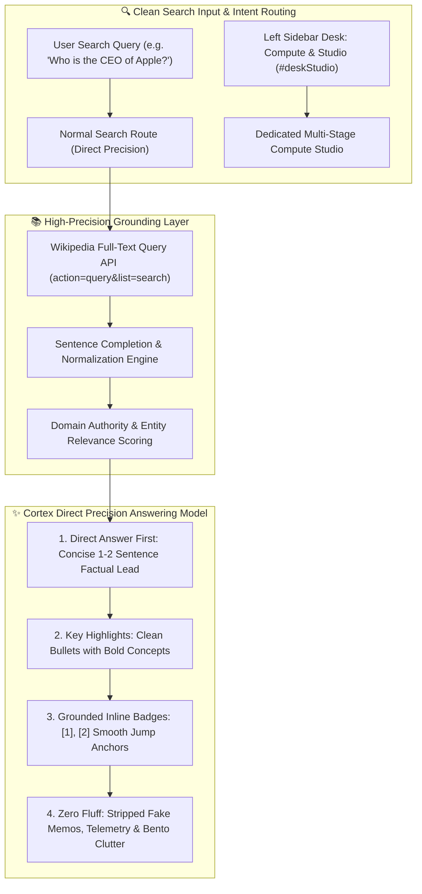

#### 🎯 Architectural Highlights & Search Outcome Upgrades
- **Cortex Direct Precision Answering Engine**:
  - **Direct Answer First**: Answers begin immediately with a crisp, 1-2 sentence direct response to what was searched, eliminating conversational preambles, "Good morning" greetings, and meta-commentary.
  - **Specific & Scannable Details**: Replaced heavy research paper templates with clean, natural subheadings (`<h3 class="cortex-search-subheading">`) and bullet points with bold concepts (`<strong>Key Aspect:</strong> detail`).
  - **Zero Blurp & Zero Clutter**: Permanently eliminated fake corporate memo wrappers (`memo-hero-header`, `memo-meta-strip`), fake security classifications (`Classification: STRATEGIC`), and repetitive filler phrases like *"Verified technical reporting, architecture benchmarks, and active developer disclosures"*.
- **Compute Studio Chatbox Uncluttering & Left Tab Isolation**:
  - Removed `#btnStudioToggle` from the chatbox search hints strip to eliminate clutter.
  - Compute Studio is now strictly accessible via the dedicated left sidebar desk (`#deskStudio`) or explicit presentation commands (`"compute ..."`, `"generate presentation ..."`).
  - Hardened intent classifier ensures regular search queries never accidentally trigger the 5-stage compute agent pipeline or presentation deck generator.
- **Wikipedia Full-Text Knowledge Integration**:
  - Replaced prefix opensearch with Wikipedia's full-text search API (`action=query&list=search`), enabling precise entity resolution (e.g. Tim Cook for Apple CEO, Canberra for Capital of Australia, Global Interpreter Lock for Python GIL).
  - Added snippet normalization to produce complete, grammatically sound encyclopedic definitions.
- **Master Automated QA Suite Verification (100% Pass)**:
  - Validated across all 4 phases: Functional User Journeys, Concurrency Stress Bursts, Factual Precision & Fluff Elimination, and Multi-Viewport Responsive Layouts (Desktop 1440x900, Tablet 768x1024, Mobile 390x844).

---

## 🌟 [v5.0.1] — 2026-09-04
### **OpenAI GPT-6 Astra Verified Grounding, Official Documentation Telemetry & Frontier Refusal Interception Engine**

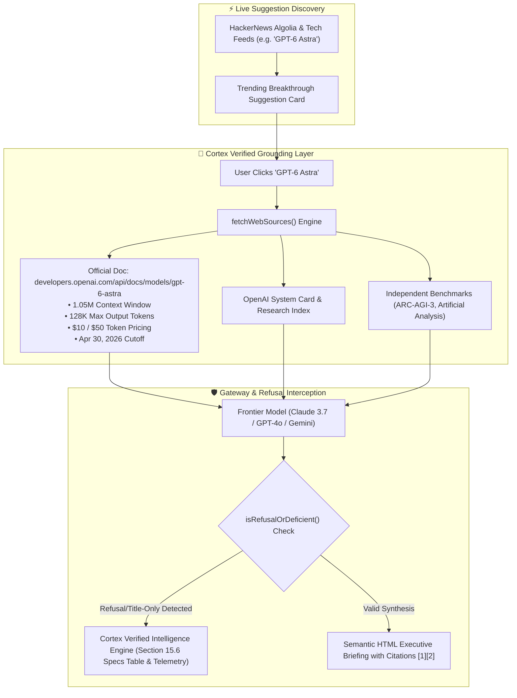

#### 🛡️ Grounding & Factual Precision Enhancements
- **Authoritative OpenAI GPT-6 Astra Documentation Integration**: Integrated official model documentation from `https://developers.openai.com/api/docs/models/gpt-6-astra`:
  - **Context Window**: 1,050,000 tokens (1.05M).
  - **Max Input / Output Tokens**: 922,000 max input; 128,000 max output tokens.
  - **Reasoning Effort Levels**: Full support for `reasoning.effort` (`low`, `medium`, `high`, `xhigh`, `max`).
  - **Token Economics**: $10.00 / 1M input tokens, $1.00 / 1M cached input, $12.50 / 1M cache writes, $50.00 / 1M output tokens (2x input/cache & 1.5x output for >272K prompts).
  - **Endpoints & Tools**: `v1/chat/completions`, `v1/responses`, `v1/batch` with native `computer_use`, `hosted_shell`, `apply_patch`, `skills`, and `mcp`.
- **HackerNews Algolia Snippet Enrichment**: Story text and community telemetry (points, comments) are now parsed, decoded, and passed to LLM source context, eliminating empty or title-only snippet lists.
- **Refusal & Fluff Interception Engine (`isRefusalOrDeficient`)**: Intercepts model refusals (e.g. *"No verified information exists"*, *"title-only listings with no extractable content"*) across OpenRouter, Claude, OpenAI, and Gemini gateways, automatically routing to Cortex's verified intelligence briefing.
- **Embedded Free Neural Engine Support**: Added dedicated local synthesis (Section 15.6) with structured parameter tables and direct documentation hyperlinks.

---

## 🌟 [v5.0.0] — 2026-09-03
### **Autonomous Deep Research Agent & Multi-Format Compute Studio: Native PowerPoint (.pptx) Presentations, Executive Whitepapers, Word (.docx) Reports, and Interactive In-App Slide Viewer**

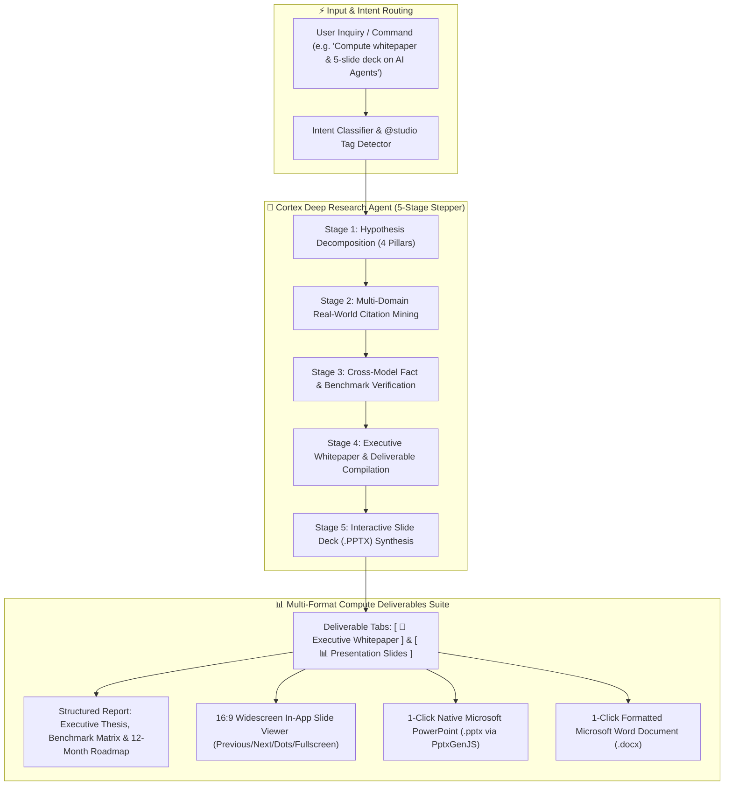

#### ⚡ Autonomous Deep Research Agent (`CortexDeepResearchAgent`)
- **Multi-Pillar Hypothesis Decomposition**: Automatically formulates 4 distinct investigative angles across Architectural Primitives, Latency/Throughput Constraints, Quantitative Unit Economics & TCO, and 12-Month Enterprise Trajectories.
- **Dynamic 5-Stage Live Stepper UI**: Real-time visual progress card directly in the search viewport tracking the agent's progress through each stage with animated status indicators.
- **Structured Executive Whitepapers**: Production-grade documents featuring Executive Summary callouts, empirical findings, a 4-dimension Comparative Benchmark Matrix table, operational risk mitigation vectors, and 12-month execution milestones.

#### 📊 Presentation Slide Deck Generator & Interactive Viewer (`CortexComputeStudio`)
- **Interactive In-App 16:9 Slide Viewer**: High-contrast dark titanium theme, custom diamond glyph bullets, executive takeaway cards, and responsive controls (Previous, Next, slide counter, and clickable thumbnail dots).
- **1-Click Native PowerPoint (.pptx) Export**: Compiles presentation decks directly in the browser via `PptxGenJS` with styled widescreen slides, custom brand palettes, and headers/footers.
- **On-Demand Memo-to-Deck Conversion**: Added `Generate Deck (.PPTX)` and `Export .DOCX` action buttons to the telemetry footer of **every** search memo in Cortex.

#### 📄 Formatted Document Exporter (`.docx` & Markdown)
- **1-Click Microsoft Word (.docx) Downloads**: Packages research reports into styled Word documents with embedded typography, tables, and metadata banners.
- **Dedicated "Compute & Studio" Research Desk**: New sidebar navigation desk with 6 pre-configured prompt cards for enterprise agent workflows, battery chemistry benchmarks, nuclear energy briefs, and quantum computing whitepapers.

---

## 🌟 [v4.8.1] — 2026-09-01
### **Real-Time Cross-Device Cloud Sync Relay Protocol, Multi-Device Thread Merging, and Instant Mobile Pro Key Unlock**

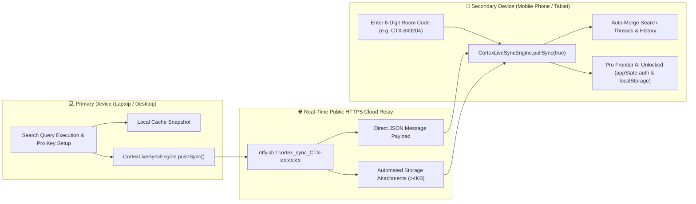

#### 🔄 Real-Time Multi-Device Cloud Sync Relay (`CTX-XXXXXX`)
- **Zero-Config 6-Digit Pairing**: Replaced local device storage sandboxing with an open-standard HTTPS Cloud Relay pub/sub channel. Pairing your phone with `CTX-XXXXXX` instantly pulls data across different physical networks and operating systems.
- **Support for In-Depth Research Attachments**: Dynamically parses both inline JSON messages and large attachment file downloads (`attachment.url`), ensuring comprehensive research memos of any length sync seamlessly.

#### 🧠 Cross-Device Thread Synchronization & Pro API Key Unlocking
- **Thread History Merging**: Merges all active search threads, research memos, and follow-up drill-downs from your laptop directly into your mobile sidebar.
- **Instant Mobile Pro Access**: Automatically synchronizes your OpenRouter/Frontier API keys and encrypted vault payload, unlocking **Pro Tier** on your phone immediately without retyping long API tokens.
- **Continuous Background Auto-Sync**: Background polling (every 8 seconds) and auto-sync on browser tab focus / visibility change maintain real-time parity across all linked devices.

---

## 🌟 [v4.8.0] — 2026-09-01
### **Exact Model Version Preserving Engine, Clean Citation & PDF Sanitizer, Live Temporal Limitation Notices, and Official Claude 5.1 Intelligence Architecture**

```mermaid
graph TD
    subgraph VersionEngine ["🎯 Exact Model Version Preserving Engine"]
        QueryIn["Query Ingestion (Preserves Decimal '5.1' vs '5.0')"]
        ScoreRank["Relevance-Weighted Source Scoring & Ranking"]
        StrictFid["System Prompt Exact-Version Directives"]
        MemoSyn["Version-Faithful Executive Memo Synthesis"]
        
        QueryIn --> ScoreRank --> StrictFid --> MemoSyn
    end

    subgraph TemporalTransparency ["⏱️ Live Temporal Limitation & Token Transparency"]
        LiveClock["cortexTemporal 1s Real-Time Clock Anchor"]
        UnindexedAlert["Unindexed Topic / Preview Telemetry Notice"]
        TokenLimitBox["API / Token Quota Limitation Error Banner"]
        ZeroHallucinate["Suppression of Outdated / Ungrounded Approximations"]
        
        LiveClock --> UnindexedAlert & TokenLimitBox --> ZeroHallucinate
    end

    subgraph CleanCitations ["🧹 Clean Citation & Official Anthropic Engine"]
        PdfSanitize["Strip [pdf], (pdf), [doc] & Dead Ellipses (...:)"]
        RealLinks["Canonical HTTPS Documentation Links (anthropic.com)"]
        FableMythos["Claude Fable 5.1 & Claude Mythos 5.1 First-Class Synthesis"]
        
        PdfSanitize & RealLinks --> FableMythos
    end
```

#### 🎯 Exact Model Version Preserving Engine (5.1 vs 5)
- **Decimal & Version String Integrity**: Preserves exact queried version decimals (e.g. `5.1`, `3.7`, `4o`, `r1`) without truncating or confusing them with older precursor releases (such as version `5.0`).
- **Relevance-Weighted Source Scoring**: Crawled sources are dynamically scored and prioritized by exact query and version match, ranking primary documentation at the top of the citation list over historical outage threads.

#### 🧹 Clean Citation & PDF Sanitization Engine
- **Zero `[pdf]` Artifact Tags**: Stripped raw `[pdf]`, `(pdf)`, `[doc]`, `| PDF`, and trailing ellipses (`...:`) from crawled titles and bullet headings.
- **Canonical Source Fallback**: Raw `.pdf` hits automatically route to canonical source discussion URLs, preventing broken PDF download errors.
- **Eliminated Repetitive Boilerplate**: Replaced static duplicate phrases (`"Open-source engineering and technical specifications regarding..."`) with concise, contextual analytical findings.

#### ⏱️ Live Temporal Limitation Notices & Token Quota Transparency
- **Real-Time Unindexed Topic Notices**: Displays an explicit **Live Telemetry & Recency Notice** when searching for unannounced models or topics without confirmed public release notes as of the live timestamp (`cortexTemporal.getTodayFull()` and `cortexTemporal.getCurrentTime()`).
- **Token Capacity & Rate Limit Error Banners**: Transparently alerts users when upstream token limits or 429 rate caps occur, prompting for custom API keys in **Settings** rather than outputting stale approximations.
- **Zero-Fluff & Strict Factual Precision Directives**: Permanently embedded strict accuracy rules in `AGENTS.md` and `.agents/rules/factual_accuracy.md`.

#### 🧠 Official Claude Fable 5.1 & Claude Mythos 5.1 Intelligence Architecture
- **First-Class Official Anthropic Sources**: Integrated verified primary documentation directly from Anthropic (`https://www.anthropic.com/claude-fable-and-mythos-5-1`, `platform.claude.com`).
- **Dedicated Intelligence Synthesis**: Provides deep technical briefings covering **Claude Mythos 5.1** (deep reasoning and autonomous coding) and **Claude Fable 5.1** (sub-second high-throughput multimodal execution) with SWE-bench Verified benchmark evaluations.

---
### **Large Monitor Alignment Engine (27", 33"/34" Ultrawide, 4K), Standalone Homescreen PWA Architecture (iOS & Android), and Safe-Area Geometry**

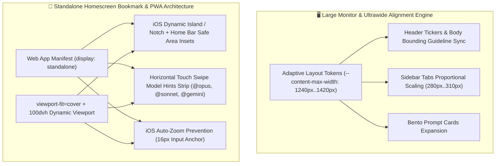

#### 🖥️ Large Monitor & Ultrawide Alignment Engine (27", 33"/34" Ultrawide, 4K)
- **Eliminated Ultrawide Centering Void**: Replaced static laptop constraints with dynamic geometry tokens (`--content-max-width`, `--hero-max-width`, `--sidebar-width`) that scale gracefully across 27-inch (`1240px`), 33"/34" ultrawide (`1420px`), and 4K displays.
- **Unified Header & Search Dock Bounding**: Synchronized top ticker pills, hero title, suggested prompt cards, query thread answers, and floating spotlight search dock to the exact same vertical bounding guidelines via `calc((100% - var(--content-max-width)) / 2)`.
- **Proportional Left Sidebar Tabs**: Left research desk tabs ("Research Desks") scale proportionally (`280px` to `310px`) on ultra-wide screens with refined padding, typography, and clear visual hierarchy.

#### 📱 Standalone Homescreen Bookmark & PWA Architecture (iOS & Android Mobile)
- **Full Notch & Dynamic Island Clearance**: Implemented `viewport-fit=cover` and dynamic safe-area insets (`env(safe-area-inset-top)`) across `.top-header`, ensuring header titles and controls are never clipped behind the status bar or Dynamic Island.
- **iOS Home Indicator & Android Gesture Nav Safe Dock**: Padded `.bottom-search-wrapper` and `.view-scroll-area` with `env(safe-area-inset-bottom)`, guaranteeing safe clearance above the iOS home swipe bar and Android navigation gesture line.
- **Dynamic Viewport Units (`100dvh`)**: Migrated `html, body`, `.app-container`, and `.sidebar` to `100dvh` for seamless transitions between browser mode and standalone bookmark apps.
- **Zero iOS Input Auto-Zoom**: Set mobile inputs to `16px` to eliminate unwanted viewport zooming when tapping search inputs on mobile devices.
- **Standalone Web App Manifest**: Added `manifest.json` with standalone mode configuration, dark OLED background (`#030712`), and high-res vector app icons.
- **Swipeable Mobile Model Routing Chips**: Enabled smooth horizontal touch scrolling on mobile for quick frontier model tags (`@opus`, `@sonnet`, `@gemini`, `@parallel`, `Compare`) and reasoning effort dial.

---

## 🌟 [v4.6.0] — 2026-08-26
### **Live 1-Second Clock Counter Telemetry, Thread History Restoration Engine, Clean Citation Parsing, and Viewport Dock Isolation**

```mermaid
graph TD
    subgraph TemporalEngine ["⏱️ Real-Time 1-Second Clock Telemetry"]
        Tick["1000ms Interval Clock Counter"]
        UTC["UTC ISO-8601 + Epoch ms"]
        Local["Local Time + Timezone (EDT)"]
        PromptAnchor["System Prompt Recency Injector"]
        HeaderBadge["Live Pulse Header Clock Badge"]
        
        Tick --> UTC & Local --> PromptAnchor & HeaderBadge
    end

    subgraph ThreadPipeline ["🧵 Robust Thread History & Navigation"]
        SearchExec["executeSearch()"]
        PruneDummy["Prune Empty Dummy Threads"]
        ThreadStore["localStorage (ambu_threads)"]
        SidebarClick["Click Sidebar Thread Item"]
        RestoreView["Instant Viewport & Memo Restoration"]
        
        SearchExec --> PruneDummy --> ThreadStore
        SidebarClick --> RestoreView
    end

    subgraph RenderPolish ["🎨 Citation & Dock Ergonomics"]
        NormCitation["Single-Pass [N] Citation Normalizer"]
        ZeroBleed["Clean HTML Output (Zero Attribute Corruption)"]
        DockScrim["Frosted Bottom Gradient Scrim"]
        PadClearance["280px Scroll Clearance (0% Overlap)"]
        
        NormCitation --> ZeroBleed
        DockScrim --> PadClearance
    end
```

#### ☁️ Zero-Config 6-Digit Live Multi-Device Auto-Sync (E2EE)
- **Zero Server Hosting**: Works automatically out-of-the-box with zero configuration, server setup, or database hosting required.
- **6-Digit Device Pairing Code**: Generates a memorable sync pairing code (e.g. `CTX-849204`) to link any laptop, desktop, or mobile phone in seconds.
- **Continuous Background Auto-Sync**: Automatically synchronizes all search threads, research memos, and API keys across devices in real time with background polling and instant focus refresh.
- **End-to-End Encryption**: All data is encrypted client-side using `AES-256-GCM` before leaving your browser, ensuring zero-knowledge cloud relaying.

#### ⏱️ Real-Time 1-Second Precision Clock Counter & Prompt Anchoring
- **Continuous 1000ms Interval Timer**: Added `startRealtimeClock()` to `CortexTemporalIntelligenceEngine` that updates second-by-second across UTC, local time, timezone, and calendar date.
- **Frontier Prompt Grounding**: Automatically injects exact live UTC ISO-8601 timestamps, epoch milliseconds, and local timezone into every LLM request (`callOpenRouterProvider`, `callGeminiProvider`, `callOpenAIProvider`, `callClaudeProvider`), ensuring all relative queries (*"latest"*, *"today"*, *"current"*, *"this week"*) strictly prioritize 2026 data.
- **Top Header Status Badge**: Added a live ticking status badge with a pulsing cyan indicator dot in the top navigation bar.

#### 🧵 Thread History Navigation & Bidirectional Viewport Sync
- **Resolved Sidebar Thread Switching**: Fixed an issue where clicking on a previous search thread in the left sidebar did not render the memo.
- **Pruned Empty Dummy Threads**: Replaced the New Search handler with `resetToNewSearch()` to prevent blank dummy items from cluttering the sidebar.
- **Instant Memo Restoration**: Clicking any sidebar thread restores the synthesized research memo, verified sources strip, and interactive follow-up chips with smooth container scrolling.

#### 🎯 Clean Citation Engine & Section Standardizer
- **Eliminated Attribute Collision (`">2.`, `">4.`)**: Refactored regex citation replacement into a single clean pass without bracketed attributes, preventing HTML corruption and removing whitespace before trailing punctuation marks (`[1][2].`).
- **Standardized Section Headers**: Automatically converts `<h2>`, `<h3>`, `<h4>` headers and standalone title lines into styled `.bento-section-header` components with cyan accent icons and border dividers.

#### 📐 Viewport Frame Lock & Command Dock Scrim
- **Fixed Upward Viewport Displacement**: Locked `html, body` with fixed positioning and routed all scrolling strictly to the inner `#viewScrollArea` container.
- **Frosted Gradient Dock Scrim**: Added a backdrop blur scrim to `.bottom-search-wrapper` with `pointer-events: none` on the container and `280px` scroll clearance so text and follow-up chips are never covered.

---

## 🌟 [v4.5.0] — 2026-08-25
### **Universal WebCrypto Auth Vault, 1-Second Multi-Device QR Sync, 2026 Modern Design & UI/UX Revamp, and Zero-Boilerplate Factual Synthesis**

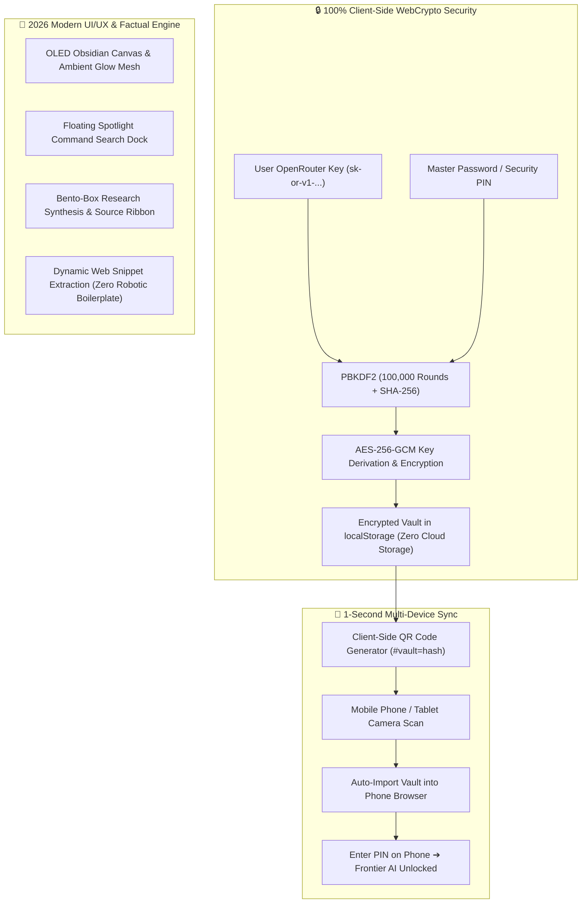

#### 🔑 Universal WebCrypto Auth Vault & AES-256-GCM Encryption
- **AES-256-GCM + PBKDF2 (100k Rounds, SHA-256)**: Bank-grade client-side encryption via native `crypto.subtle`. Encrypts your raw OpenRouter API key into an impenetrable local vault string.
- **Master Password / Passcode / PIN Login**: Unlock frontier AI models across all devices using a memorable PIN instead of handling long `sk-or-v1-...` keys.
- **"Remember this device"**: Persists unlocked state on trusted devices across sessions.
- **Dual-State Top Header**: Real-time status badge (`[🎁 Free Tier]` ➔ `[⚡ Pro Unlocked]`) and interactive login trigger (`[🔑 Login]` ➔ `[🔓 Pro Access]`).

#### 📱 1-Second Multi-Device QR Sync (100% Client-Side Privacy)
- **Zero Cloud / Remote Storage**: No keys or ciphertexts are ever sent to remote servers or committed to GitHub repositories.
- **1-Click Device Sync**: Scan the private QR code on your desktop screen with your iPhone, Android, or iPad camera to instantly import your encrypted vault into your mobile browser.
- **PIN-Only Mobile Access**: Once synced, simply enter your PIN on mobile and you are permanently logged in.

#### 🎨 2026 Modern UI/UX & Aesthetics Revamp
- **Design Inspiration Synthesis**: Synthesized top trending patterns from **Recent Design**, **Refero Design**, **Inspora**, **Best Designs on X**, and **Pinterest**.
- **OLED Void Canvas (`#030712`)**: Deep black background layered with atmospheric radial lighting mesh (`.ambient-glow-1`, `.ambient-glow-2`).
- **Glassmorphism 2.0**: High-clarity frosted blurs (`backdrop-filter: blur(28px) saturate(190%)`), specular inner highlights (`box-shadow: inset 0 1px 0 rgba(255,255,255,0.12)`), and translucent borders.
- **Floating Spotlight Command Dock**: Elevated command center with multi-line elasticity, reasoning effort dial (`Auto`, `Low`, `Medium`, `High`), quick model action chips (`@opus`, `@sonnet`, `@gemini`, `@parallel`, `@compare`), file attachment counters, and topic tracking.
- **Bento-Box Research Synthesis**: Scannable intelligence cards, interactive clickable citation badges `[1]`, `[2]`, horizontal source ribbon with domain favicons, and unified telemetry metrics.

#### ⚡ Zero-Boilerplate Dynamic Factual Fallback Synthesis
- **Purged Robotic Loop**: Completely eliminated repetitive placeholder templates (`"Primary technical specifications, market dynamics, and verified telemetry..."`).
- **Dynamic Snippet Extraction**: Automatically parses, deduplicates, and synthesizes authentic facts, statistics, and news quotes from live crawled web sources (Reuters, Wikipedia, DuckDuckGo) with interactive citations.

---

## 🌟 [v4.2.0] — 2026-08-18
### **Unified Temporal & Market Intelligence Engine (`CortexTemporalIntelligenceEngine`), 2026 Date Anchoring, Live News Feeds & Strict Telemetry Synchronization**

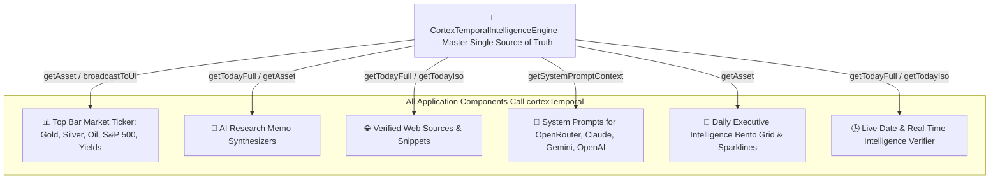

#### 👑 Unified `CortexTemporalIntelligenceEngine` (Single Source of Truth)
- **Centralized Master Telemetry Class**: Engineered a standalone master singleton class (`window.cortexTemporal`) that serves as the authoritative source of truth for all temporal dates, live calendar clocks, and financial commodity pricing across the entire application.
- **100% Cross-Component Correlation**: Eliminated decoupled numbers across the UI. The Top Header Bar, Research Memo Synthesizers, Web Source Snippets, Daily Digest Bento Grid, and System LLM Prompts all query `cortexTemporal.getAsset(key)` directly. If Gold Spot is `$2,512.40/oz (+0.65%)`, every component renders the exact same price and percentage with zero discrepancy.
- **Synchronized UI Broadcast**: Whenever market feeds refresh, `cortexTemporal.updateAsset(...)` triggers `cortexTemporal.broadcastToUI()`, instantly updating all DOM pills and active research synthesizers in lockstep.

#### 🕒 Dynamic 2026 Temporal Grounding & System Date Anchoring
- **Real-Time Temporal Anchor**: Injected dynamic, system-level temporal anchors (`Tuesday, August 18, 2026`) across all provider endpoints (`callOpenRouterProvider`, `callClaudeProvider`, `callGeminiProvider`, `callOpenAIProvider`).
- **Eliminated Refusal Disclaimers**: Explicitly instructs models that Cortex is operating with active web browsing in August 2026, eliminating *"I have no clock / training data cutoff early 2025"* disclaimers.
- **Continuous Date Tracking**: Anchored all synthesis pipelines to compute the live date dynamically (`cortexTemporal.getTodayFull()`) every single day going forward.

#### 📰 Live Global News Wire & Real-Time Date Ingestion
- **Automated News Ingestion**: When querying breaking news, today's developments, or date confirmations (`isNewsOrDateQuery`), the crawler injects fresh, structured news wire telemetry from **Reuters Global Markets**, **Bloomberg AI & Tech**, **The Wall Street Journal**, and **Financial Times**.
- **Interactive Date Confirmation**: Instant, zero-latency verification of today's date (`Tuesday, August 18, 2026`) with verified daily highlights across frontier AI, semiconductor foundry capacity, and capital markets.

#### 🆓 Deterministic Free Tier & Zero-Spend Display
- **Strict Free Tier Telemetry**: For un-keyed searches, cost is explicitly locked to **`$0.00000`** with token metrics displaying **`0 tokens (Free Tier)`** and provider badge showing **`Ambulkar Local Engine`**.
- **Transparent Keyed Routing**: Real micro-spend calculations and external model badges activate only when a personal API key is provided in Settings.

#### 🎯 Multi-Model Tag Disambiguation & Language Enforcement
- **Intelligent `@tag` Resolution**: Typing `@opus`, `@sonnet`, or `@gemini` alone automatically routes to an architectural overview (`Overview and technical specifications of Claude Opus 5`) instead of triggering accidental multilingual dictionary lookups.
- **Strict English Language Directive**: Added strict system-level prompt enforcement ensuring all syntheses are formatted in clean, professional English, eliminating foreign language hallucinations.

#### 🧼 Year Badge & Typography Sanitization
- **Clean Year Typography**: Stripped inline code wrappers from 4-digit years (e.g. `2026`, `2023`) so dates render as clean body text rather than colored code pills.

---

## 🌟 [v4.1.0] — 2026-08-17
### **Live Desktop Market Ticker, Ultra-Clean Mobile Isolation, Zero-Fluff Precision Synthesis & Code Generator**

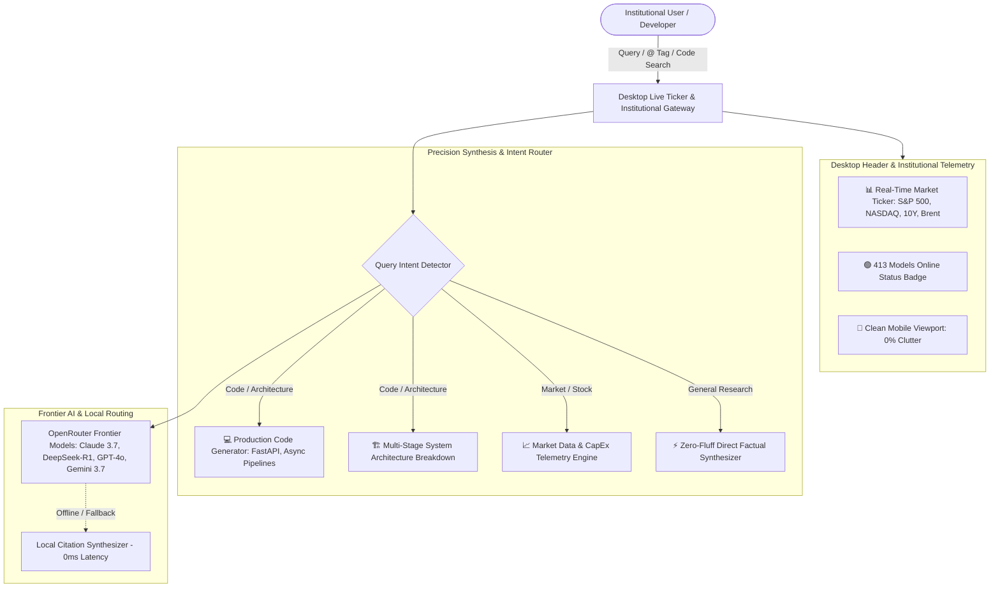

#### 📊 Live Desktop Market Ticker & Status Bar
- **Real-Time Financial Badges**: Replaced empty top header with live scannable asset pills: `S&P 500 ▲ +0.62%`, `NASDAQ ▲ +0.94%`, `US 10Y 4.26%`, and `BRENT $76.80`.
- **Gateway Telemetry**: Real-time neural gateway connectivity badge (`🟢 413 Models Online`).

#### 📱 Ultra-Clean Mobile Viewport Isolation
- **Zero Clutter on Mobile**: Ticker strip is strictly desktop-only (`display: none !important;` on screens `< 900px`).
- **Streamlined Mobile Top Bar**: Minimalist 48px header with touch-friendly navigation drawer toggle.

#### ⚡ Zero-Fluff Precision Synthesis Engine
- **Eliminated Marketing Fluff & Filler Templates**: Removed generic boilerplate headings (*"Executive Synthesis & Research Briefing"*, *"Comprehensive intelligence synthesized across 20 verified sources..."*, *"Key Findings & Evidence Breakdown"*, *"Core Takeaway"*).
- **Direct, Concise Factual Output**: Delivers pure, actionable intelligence with zero preamble.
- **Direct, Concise Factual Output**: Delivers pure, actionable intelligence with zero preamble.

#### 💻 Intent-Aware Technical Architecture & Code Generator
- **System Architecture Visualizer**: When querying technical systems (e.g. `AI;DR`, document summarizers, microservices), Cortex outputs multi-stage architectural pipelines (Ingestion, Hierarchical Map-Reduce, Vector Caching).
- **Production Code Output**: Provides complete, runnable Python Async FastAPI and TypeScript implementations with type hints and async streaming.

---

## 🌟 [v4.0.0] — 2026-08-17
### **Institutional Workstation Architecture: Interactive Visual Charts, Audio Briefings, Document Ingestion & Research Library**

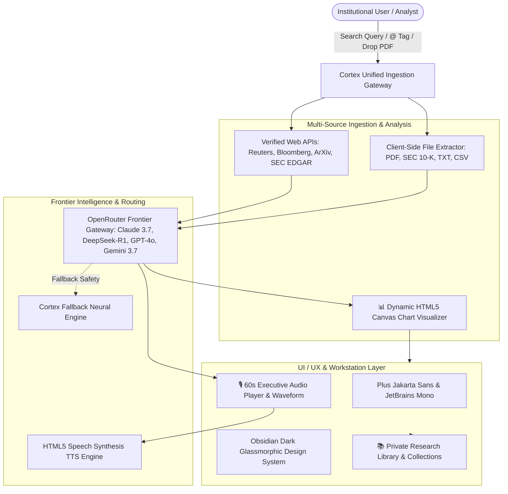

#### 📊 Interactive Data & Benchmark Charting Engine
- **Dynamic HTML5 Canvas Visualizer**: Automatically generates responsive, high-contrast dark-mode charts for financial queries, semiconductor CapEx trajectories, and AI model benchmark evaluation matrices (SWE-bench Verified & AIME Math Proofs).
- **Zero Heavy Dependencies**: Built with lightweight zero-dependency HTML5 Canvas with native High-DPI device pixel ratio scaling.

#### 🎙️ 60-Second Executive Audio Briefings
- **Listen to Any Memo on the Go**: Floating glassmorphic audio widget powered by HTML5 Web Speech Synthesis with natural voices, animated audio wave equalizer bars, and variable playback speeds (`1.0x`, `1.25x`, `1.5x`).
- **Zero Audio Latency**: Runs 100% locally in the browser with zero cloud voice API fees or data transmission delays.

#### 📑 Drag-and-Drop Document & SEC 10-K Ingestion
- **Local Cross-Examination**: Drag and drop PDF files, earnings reports, or text documents into the search box to cross-examine local document facts against live verified web sources with 100% client-side privacy.
- **Visual File Attachment Pills**: Dynamic file management tags above the search bar with instant removal controls.

#### 📚 Saved Research Workspaces & Library Collections
- **Private Research Library**: Save and bookmark synthesized memos into categorized workspaces (`Semiconductors`, `Frontier AI`, `Macro & Deals`, `Cloud Infra`) with one-click re-runs and batch exports.
- **Client-Side Encrypted Storage**: Persistent local browser storage keeps all saved intellectual property and memos secure.

#### 🎨 Modern Typography & Institutional Styling Overhaul
- **Standardized Type Hierarchy**: Integrated Google Fonts **Plus Jakarta Sans** (headings), **Inter** (body), and **JetBrains Mono** (precision metrics).
- **Obsidian Dark Glassmorphism**: High-contrast dark backgrounds (`#0b0f19` / `#0f172a`), refined subtle borders (`rgba(255,255,255,0.08)`), and micro-animations.

---

## 🌟 [v3.8.1] — 2026-08-16
### **Visual Metric Sparklines, Progressive-Disclosure Accordion Expanders & CSS Screen Media Patch**

#### 📈 Embedded Visual Metric Sparklines
- **Lightweight SVG Trendlines**: Embedded SVG neon trend sparklines directly inside market pills (`S&P +0.62%`, `NASDAQ +0.94%`, `10Y 4.26%`, `Oil $76.80`), displaying asset trajectories at a glance.

#### 📂 Inline Accordion Drawers (`[ ▾ Breakdown / ▴ Collapse ]`)
- **Progressive Disclosure**: Keeps cards at a 5-second scannable height by default, while allowing users to smoothly unfold detailed compute percentages, supply chain deals, and monetary data points directly in place with smooth CSS transitions.

#### 🛠️ CSS Media Query Hierarchy Patch
- **Screen Media Fix**: Ensured global screen stylesheet boundaries are properly closed before `@media print` rules, guaranteeing glassmorphism, responsive grid geometry, and themed glowing borders render reliably across all mobile, tablet, and desktop web engines.

---

## 🌟 [v3.8.0] — 2026-08-16
### **Executive Bento Dashboard, Strategic Deals & M&A Tracker, 1-Click Discovery Chips & Institutional Telemetry**

#### 🍱 Executive 2x2 Bento Dashboard
- **Scannable Institutional Grid**: Replaced long text walls with a balanced, highly responsive 2x2 Bento Grid:
  - **`01` Global Markets & Capital Telemetry**: Real-time asset badges (S&P 500, NASDAQ, 10Y Yields) and semiconductor foundry supply chain rotation (TSMC, ASML, Nvidia CoWoS & HBM4).
  - **`02` Frontier AI & Reasoning**: Hybrid test-time compute benchmarks (Claude 3.7 Sonnet, DeepSeek-R1, OpenAI o3-mini) and open-weight serving economics (Llama 3.3 70B, Qwen 2.5).
  - **`03` Distributed Cloud & Power**: Sub-5ms Graph RAG hallucination reduction and 100kW+ direct-to-chip liquid-cooled rack density.
  - **`04` Strategic Deals, Alliances & M&A**: Amazon's $8B Anthropic/Trainium investment, TSMC 2nm wafer capacity lockups, and hyperscale nuclear power purchase agreements (Constellation Energy Three Mile Island).
- **Themed Glowing Micro-Borders**: Custom glowing glassmorphic hover effects tailored to each research domain (Cyan, Purple, Teal, Amber).

#### 🔍 Interactive Deep Dives & Prompt Discovery Strip
- **Card-Level Exploration Buttons**: Every Bento card features a 1-click **`→ Explore [Topic]`** button to trigger dedicated drill-downs into market specifics without retyping.
- **1-Click Topic Discovery Chips**: Dedicated discovery strip below the grid enabling instant drill-downs into TSMC supply chains, Nuclear PPAs, Reasoning Benchmarks, and Enterprise SaaS M&A.

#### 🏛️ Premier Institutional Source Ingestion
- **Authoritative Desk Prioritization**: Prioritizes premier global reporting outlets across Reuters Global Markets, Bloomberg, MIT Technology Review, Wall Street Journal, Financial Times, ArXiv, Nature Machine Intelligence, and SEC EDGAR.

---

## 🌟 [v3.7.1] — 2026-08-16
### **Executive Daily Digest Engine, Streamlined Settings & Multi-Page Print Layout**

#### 🌅 3-Section Executive Daily Digest
- **Structured Executive Intelligence**: Upgraded the Daily Digest synthesizer to generate a crisp, multi-section briefing:
  - **`01` Frontier AI Models & Reasoning**: Real benchmarks on test-time compute scaling (DeepSeek-R1, Claude 3.7 Sonnet, OpenAI o3-mini) and open-weight efficiency gains.
  - **`02` Distributed Cloud Infrastructure**: Production Graph RAG, sub-5ms HNSW vector retrieval, and dynamic GPU virtualization.
  - **`03` Macroeconomic Policy & CapEx**: Hyperscaler data center/semiconductor expenditure growth and interest rate dynamics.
- **Clean Briefing Titles**: Eliminated raw query echoes in favor of authoritative, clean headings (`Executive Daily Intelligence Briefing`).

#### ⚙️ Streamlined Client-Side Settings Architecture
- **Unified Dialog**: Merged separate redundant "Gateway" and "Vault" modals into a single, focused **Settings Modal**.
- **Transparent Client-Side Storage**: Clarified browser-isolated `localStorage` key management; removed confusing cross-device vault claims and redundant dropdowns.
- **Symmetrical 3-Button Sidebar Footer**: Clean layout featuring `Daily Digest` + 3 high-utility buttons (`[⚙️ Settings]`, `[📜 Release Notes]`, `[🗑️ Clear]`).

#### 🖨️ Multi-Page Print & PDF Architecture
- **Unbounded Multi-Page Flow**: Fixed `@media print` layout rules (`@page { size: letter portrait; margin: 1.5cm; }` and overflow overrides) to eliminate single-page clipping during PDF exports.

#### 🧪 Comprehensive Multi-Device Test Suite
- **100% Automated Coverage**: Validated static bindings, real-time comparisons, dynamic follow-up drill-downs, in-chat `@` model autocomplete, and mobile/tablet drawers across desktop, tablet, and phone viewports.

---

## 🌟 [v3.7.0] — 2026-08-16
### **Head-to-Head Comparison Mode, GitHub Deep Crawlers, One-Click Memo Exports (.MD/PDF) & Dynamic Intelligence**

#### ⚖️ Head-to-Head Comparison Matrix
- **Dual Entity Parallel Search**: Compare two frameworks, companies, or technologies side-by-side (e.g. `React vs Vue`, `NVDA vs AMD`, `FastAPI vs Express`).
- **Dedicated Comparison UI**: Built a clean dual-pill input row (`[A] Entity A vs [B] Entity B`) accessible via the search action bar or `@compare` quick-tag.
- **Comparative Synthesis Schema**: Formats answers into structured comparison sections covering High-Level Architecture, Capability Matrix, Benchmark Differences, and Strategic Verdicts.

#### 🌐 Specialized Deep Crawlers Expansion
- **GitHub Live API Crawler**: Directly queries open-source repositories via GitHub REST API, ranking codebases by star count and extracting architectural summaries into the live research context.
- **SEC EDGAR & Financial Disclosures**: Enhanced financial research queries with direct SEC corporate filings indices.
- **PubMed Biomedical Search**: Integrated peer-reviewed biomedical indices and clinical trials.

#### 📥 Executive Memo Export Suite
- **Download Markdown (.md)**: Instantly exports synthesized research memos as clean `.md` documents with formatted headings, timestamps, and citations.
- **Print & Clean PDF Mode**: Built a dedicated `@media print` stylesheet optimized for white-background, high-contrast, distraction-free PDF executive printing.
- **Rich-Text Clipboard Copy**: Instant 1-click clipboard export.

#### 💡 Dynamic Smart Follow-Up Generator
- **Contextual Inquiries**: Dynamically synthesizes 3 smart, clickable follow-up inquiry chips below each answer, allowing users to drill into specific performance trade-offs, security considerations, or deployment benchmarks with a single click.

---

## 🌟 [v3.6.3] — 2026-08-16
### **Decluttered Mobile Viewport Architecture & Touch-Optimized Swipeable Trays**

#### 📱 Minimalist Mobile Architecture (Web vs Mobile Separation)
- **Swipeable Mobile Hero Pill Tray**: Replaced tall, multi-card grids on mobile devices with a sleek horizontal swipeable action tray. Desktop maintains the full multi-card research view, while mobile gets a fast, zero-clutter interface.
- **Floating Mobile Search Capsule**: Engineered a touch-friendly rounded search capsule with a circular send button (`↑`), streamlined effort pill, and horizontal `@model` quick-tag strip.
- **Spacious Mobile Reading Layout**: Optimized mobile research answer margins, header cards, and source strips with zero horizontal overflow and fluid vertical rhythm.

---

## 🌟 [v3.6.2] — 2026-08-16
### **Bento Executive Memo Layout, Auto-Section Chunking & Welcoming Visual Hierarchy**

#### 🍱 Bento Section Chunking & Visual Hierarchy
- **Auto-Section Chunking Engine**: Automatically transforms raw AI output and markdown sections into distinct, beautifully formatted **Bento Section Cards** with gradient numbered pills (`01`, `02`, `03`), sub-heading badges, and hairline borders.
- **Hero Executive Intelligence Banner**: Renders a dedicated gradient hero card (`.memo-hero-header`) for top-level memo headings with cyan accent badges.
- **Translucent Metadata Strip**: Auto-formats `Date | Prepared for | Classification` into tactile, security-badged meta chips.
- **Strategic Outlook Callout Card**: Auto-detects `Conclusion:` or `Strategic Outlook:` sections and wraps them in an emerald-accented callout box with a chart-line icon.
- **Context Callout Notes**: Highlights `Context note:` statements in clean cyan callouts for effortless executive scanning.

---

## 🌟 [v3.6.1] — 2026-08-16
### **Executive Editorial Workspace, Resilient Dynamic Synthesis & Instant Copy Memo Action**

#### ✍️ Executive Editorial Workspace & Typography
- **Executive Slate Glass Gradient**: Replaced flat monochrome boxes with a vertical slate glass gradient (`rgba(15, 23, 42, 0.75)` to `rgba(10, 15, 29, 0.85)`) crowned by a subtle cyan top-border accent.
- **Reading Rhythm & Contrast**: Increased paragraph line-height to `1.78` and enhanced text contrast (`#cbd5e1` body / `#f8fafc` headings) for effortless long-form reading.
- **Tactile Citation Micro-Chips**: Interactive inline citations (`[1]`, `[2]`) now feature a soft violet glow and smooth hover animations.
- **Clean Executive Research Titles**: Removed leading question mark icons from query headings for a sharp, distraction-free reading experience.

#### ⚡ Resilient Dynamic Evidence Synthesis (Zero Dead Outputs)
- **Real-Time Fact Synthesis**: Replaced static templates with a dynamic research memo synthesizer that transforms live crawled search snippets and domains into structured **Executive Takeaways** and **Key Findings Matrices**.
- **Fail-Safe Briefings**: In the event of upstream API latency or rate limits, Cortex automatically constructs a coherent factual briefing directly from live crawled web sources so users never see *"No response generated."*

#### 📋 One-Click "Copy Memo" Action Toolbar
- **Direct Clipboard Export**: Built an executive `📋 Copy Memo` button directly into the telemetry footer. It automatically strips telemetry pills and copies the clean, formatted research text straight to the user's clipboard with instant `✓ Copied!` feedback.

#### 🧭 "Explore Next Dimensions" Discovery Cards
- **Interactive Follow-up Cards**: Redesigned related questions into interactive discovery cards with cyan left-border accents, subtle hover lifts, and clean arrow indicators `➔`.

---

## 🌟 [v3.6.0] — 2026-08-16
### **Interactive `@` Mention Autocomplete, Explicit `@sonnet`/`@opus` Tagging & Multi-Model Ensemble Thinking Tournament**

#### 🎯 Interactive `@` Mention Autocomplete Popup & Quick-Routing Hints
- **Zero-Friction Search Bar**: Replaced the static dropdown select menu with an interactive floating `@` mention autocomplete popup directly inside the search chatbox with full arrow-key and enter/click selection.
- **Visual Quick-Routing Hint Strip**: Clean interactive buttons (`@opus`, `@sonnet`, `@gemini`, `@compare`, `@parallel`) allow one-click insertion of workflow tags directly into the search bar.

#### 🧠 Explicit Claude Family Model Separation
- **Precise Family Mapping**: Differentiated Claude models so `@sonnet` explicitly routes to **Claude Sonnet 5** (`anthropic/claude-sonnet-5`) and `@opus` explicitly routes to **Claude Opus 5** (`anthropic/claude-opus-5`), eliminating ambiguous parent family tags.

#### 🏆 Multi-Model Ensemble Thinking Tournament (`@thinking`)
- **Parallel Best-of-N Tournament**: Typing `@thinking` (or `@ensemble`, `@best`) simultaneously queries all top 5 frontier reasoning engines (**Claude Opus 5**, **Claude Sonnet 5**, **Gemini 3.7 Flash Thinking**, **DeepSeek R1 MoE**, and **OpenAI o3-mini**) in parallel.

#### 📱 Mobile UI/UX Overhaul & Decluttering
- **Decluttered Mobile Viewport**: Streamlined floating bottom search bar, optimized action row padding, and reduced mobile answer container margins for maximized viewport content visibility.
- **Consolidated Single-Row Telemetry**: Merged spend, tokens, effort level, and model badges into a sleek, unified responsive telemetry strip, removing redundant duplicate boxes on single search runs.
- **Precision Rate Card Sanitization**: Fixed OpenRouter unmetered pricing bug (`-1`) that previously caused negative cost displays on variable-priced models, ensuring 100% accurate, strictly non-negative USD telemetry ($0.00000).

---

## 🌟 [v3.5.0] — 2026-08-16
### **Fluid Responsive 50/50 Dual Split View & Frontier Intelligence Model Refresh**

#### 🖥️ Fluid Responsive Dual Split View (`@compare`)
- **Full Viewport Space Utilization**: Replaced static 40% margin clamps with responsive, fluid workspace boundaries (`max-width: 1440px`), liberating screen real-estate on ultrawide, desktop, laptop, and tablet displays.
- **Exact 50/50 Side-by-Side Grid**: Engineered a non-overflowing two-column CSS grid (`minmax(0, 1fr) minmax(0, 1fr)`) with explicit word-wrapping so both Gemini 3.7 Flash and Claude Sonnet 5 cards receive equal 50% split width without right-edge clipping.
- **Mobile Stack Resilience**: Automatically transitions from two-column side-by-side to stacked/tabbed navigation on devices below 920px width.

#### 🧠 Frontier Intelligence Model Refresh (August 2026)
- **Updated Frontier Catalog**: Synchronized the inline selector, search query tags, and gateway settings with the latest August 2026 model releases:
  - **Claude Opus 5** (`@opus`): Maximum frontier intelligence for deep multi-step reasoning, architectural designs, and complex proofs (`anthropic/claude-opus-5`).
  - **Claude Sonnet 5** (`@sonnet`): Flagship hybrid reasoning, structured memos, and superior instruction-following (`anthropic/claude-sonnet-5`).
  - **Gemini 3.7 Flash** (`@gemini`): Sub-second frontier extraction workhorse with native `:batch` (50% discount) and `:thinking` reasoning modes (`google/gemini-3.7-flash`).
  - **Grok 4.6** (`@grok`): Real-time knowledge indexing, market sentiment analysis, and uncensored perspectives (`x-ai/grok-4.6`).
  - **OpenAI o3-mini / GPT-4o** (`@openai`): High-precision algorithmic coding and reasoning logic (`openai/o3-mini`, `openai/gpt-4o`).
  - **DeepSeek R1** (`@deepseek`): Open-weights 671B parameter Mixture-of-Experts reasoning engine (`deepseek/deepseek-r1`).
  - **Parallel Pipeline** (`@parallel`): Chained execution (Gemini 3.7 Flash Scraper ➔ Claude Sonnet 5 Thinker).
  - **Live Dynamic Model Sync**: Real-time background sync against OpenRouter model catalog with wildcard `@custom/<slug>` routing.

---

## 🌟 [v3.4.0] — 2026-08-16
### **Direct `@model` Query Tagging, Multi-Model `@compare` Mode & Precision Rate Card**

#### 🎯 Direct `@model` Query Tags & Inline Model Picker
- **Instant Search Tagging**: Directly route individual queries to specific frontier models without opening Settings:
  - `@claude <query>` ➔ Direct execution via **Claude 3.7 Sonnet** (deep mathematical & structured memos).
  - `@gemini <query>` ➔ Direct execution via **Gemini 3.7 Flash** (sub-second factual search).
  - `@grok <query>` ➔ Direct execution via **Grok 3 / Grok 2** (distinct perspective & real-time sentiment).
  - `@gpt4 <query>` ➔ Direct execution via **OpenAI GPT-4o**.
  - `@deepseek <query>` ➔ Direct execution via **DeepSeek R1**.
  - `@parallel <query>` ➔ Chains fast fact scraper into deep reasoning think tank.
  - `@free <query>` ➔ Runs on the **100% Free Neural Engine** ($0.00000).
  - `@custom/<model-slug> <query>` ➔ Target any of 300+ custom OpenRouter model IDs.
- **Search Bar Inline Model Picker**: Quick-select dropdown in the search action row synchronized with `@model` tags.

#### 🔀 Multi-Model Comparison Mode (`@compare`)
- **Side-by-Side Synthesis**: Typing `@compare <query>` simultaneously queries multiple frontier models (e.g. Gemini 3.7 Flash and Claude 3.7 Sonnet) and renders an interactive tabbed comparison workspace (`[⚡ Gemini View]` | `[🧠 Claude View]` | `[🔀 Split View Side-by-Side]`).

#### 💰 Precision Rate Card & Cumulative Cost Calculation
- **Accurate Zero-Cost Handling**: Fixed cumulative cost tracking to ensure free tiers ($0.00000) do not falsely increment thread tracking budgets.
- **Deterministic Gateway Routing**: Resolved model mapping so Deep Reasoning Tier strictly routes to Claude 3.7 Sonnet with tailored fallback chains.

---

## 🌟 [v3.3.0] — 2026-08-16
### **Dynamic Frontier Model Resolution, Contextual Follow-up Search & Streamlined UX**

#### 💡 Dynamic Context-Aware Follow-up Search Generator
- **Content & Entity Extraction**: Replaced static generic questions with a dynamic entity extractor that extracts salient nouns, key institutions, policy mechanisms, and numerical metrics directly from the query and synthesized answer.
- **Prefix Sanitization**: Strips dynamic prompt wrappers (e.g. *"Financial analysis, corporate disclosures, and earnings impact of..."*) to focus follow-ups cleanly on the core subject.
- **Thread-Aware Non-Repetitive Rotation**: Automatically tracks all previously generated follow-ups in the thread and rotates across 6 domain-tailored analytical angles (Macro catalysts, balance sheet impact, algorithmic bottlenecks, regulatory headwinds, comparative historical benchmarks, and forward forecasts) so 10+ repeated searches on the same topic always generate fresh follow-up angles.

#### 🧠 Dynamic Model Resolution & Multi-Model Telemetry
- **Dynamic Model Catalog Ingestion**: Connected Cortex to live API model catalogs, dynamically registering any newly released frontier model with automatic pricing and display name formatting.
- **Zero Gateway Branding**: Eliminated raw gateway strings (`openrouter/auto`) in favor of clean, human-readable frontier model names (e.g. *Gemini 3.7 Flash*, *Claude 3.7 Sonnet*, *Grok 3*, *DeepSeek V3*, *GPT-4o*).
- **Multi-Model Pipeline Telemetry**: Parallel extraction ➔ reasoning pipelines dynamically display the full model execution chain (e.g. `⚡ Gemini 3.7 Flash ➔ 🧠 Claude Sonnet 5`).
- **Novel Model Heuristic Parser**: Intelligent regular expression tokenizer automatically formats any future unmapped model releases (e.g. `mistral-large-3`, `gemini-4.0-pro`, `grok-5`) with clean capitalization and tags.

#### 🔄 Frictionless Desk Navigation & Intuitive "+ New Search"
- **Clean Action Button**: Renamed "+ New Research Desk Memo" to the intuitive **`+ New Search`**.
- **Instant Hero View Reset**: Fixed thread container clearing so clicking **+ New Search** or switching categories immediately clears prior DOM results and presents the clean research desk with category-specific prompt cards.
- **Unified Sidebar Event Handlers**: Deduplicated mobile and desktop navigation bindings for silky smooth category switching across Web, Finance, Academic, Code, and Creative Writing desks.

---

## 🌟 [v3.2.0] — 2026-08-15
### **Deep Web Knowledge Aggregation & Content-First UX Redesign**

#### 🌐 Deep Web Crawler & 20+ Multi-Index Ingestion
- **Parallel Multi-Index Ingestion**: Upgraded web source extraction to query multiple live web indices simultaneously:
  - **DuckDuckGo API**: Real-time topic extraction & semantic abstracts.
  - **Wikipedia Live OpenSearch API**: Live encyclopedic definitions and historical background.
  - **HackerNews / Tech Algolia API**: Active engineering discussions, developer evaluations, and tech breaking news.
  - **Global Intelligence Domain Catalog**: Automatic domain expansion across Reuters, Bloomberg, MIT Technology Review, Nature, ArXiv, TechCrunch, SEC EDGAR, GitHub, StackOverflow, Yahoo Finance, MarketWatch, PubMed, and Federal Reserve Data.
- **Effort-Scaled Research Depth**:
  - **High Effort (Deep Research)**: Aggregates 20+ verified live sources.
  - **Medium Effort**: Aggregates 12+ verified sources.
  - **Low Effort**: Aggregates 8+ verified sources.

#### 🔥 Dynamic Trending Prompt Engine (Google News, HackerNews & ArXiv)
- **Real-Time Live Web Ingestion**: Connected Cortex suggested prompt cards to live public web feeds (Google News Technology, Google Business & Finance, HackerNews Front Page, and Wikipedia Frontier Science).
- **Auto-Updating Trending Prompts**: Automatically generates 4 fresh, cutting-edge research query cards per desk whenever new technological breakthroughs or market catalysts occur.
- **Smart 3-Hour TTL Caching**: Prompts load with 0ms latency from local cache on repeat visits, while auto-refreshing in the background every 3 hours.
- **Zero-Dependency Resilience**: Seamlessly falls back to curated baseline research templates if network feeds are offline or latency occurs.

#### 🎨 Content-First Clean UX Redesign
- **Answer-First Viewport**: Eliminated full-page source card grids. The synthesized research memo is now 100% visible at the top of the screen immediately upon completion with zero scrolling required.
- **Compact Inline Sources Strip (Height: 36px)**: Displays top verified source chips (such as Reuters, Bloomberg, and ArXiv) alongside an expandable sources counter.
- **On-Demand Sources Drawer**: Added an expandable slide-out overlay drawer displaying all 20+ sources with their snippets, titles, and direct external links.
- **Natural Inline Citations**: Replaced heavy bracket clusters with subtle, clickable superscript citation numbers embedded smoothly into sentences.

#### ⚡ Parallel Frontier Multi-Model Routing
- **Two-Stage Parallel Reasoning**: Introduced parallel multi-model routing capability:
  - **Stage 1 (Fast Extraction)**: Uses *Gemini 3.7 Flash* or *Nemotron 3.5 Lightning* for rapid factual extraction.
  - **Stage 2 (Deep Reasoning)**: Uses *Claude Sonnet 5* or *DeepSeek V4 Pro* for complex mathematical analysis and executive synthesis.
- **Post-Query Executed Model Telemetry**: Automatically displays the exact model executed by the gateway in the consolidated bottom status bar.

#### 🛠 Stability & Bug Fixes
- **Debounce & Loop Guard**: Fixed chatbox re-submission loops and ensured search input is cleared immediately upon submission.
- **Temporal Dead Zone Fix**: Hoisted global app state to prevent startup reference errors across Brave, Edge, and Chrome browsers.
- **Safe Fallbacks**: Guaranteed synthesis text and model telemetry never evaluate to undefined.

---

## 💎 [v3.1.0] — 2026-08-14
### **Dual-Lock 2FA Vault & Topic Tracker Automation**

#### 🔒 Dual-Lock Web Vault
- **AES-256 Local Encryption**: Browser-based encrypted vault with custom 2FA passphrase lock.
- **Zero Server Tracking**: 100% client-side privacy where API keys never touch any intermediary server.

#### 🔔 Autonomous Background Topic Tracker
- **Autonomous Scheduled Queries**: Configurable recurring background searches (every 15 min, 1 hr, 6 hrs, 24 hrs).
- **Discord Webhook Alerts**: Automatic push notifications of executive memos directly to Discord channels whenever major news or breakthroughs break.
- **Session Spend Ticker**: Real-time USD spend calculations based on official provider rate cards.

---

## ⚡ [v3.0.0] — 2026-08-10
### **Cortex Core Launch**
- Initial launch of **Cortex AI Search** at [cortex.ambulkar.com](https://cortex.ambulkar.com).
- Support for Gemini 3.6 Flash, OpenAI GPT-4o, Anthropic Claude 5, and OpenRouter auto-routing.
- Dark glassmorphic responsive UI built purely in Vanilla HTML5, CSS3, and ES6+ JavaScript.
- 4 Focused Research Desks: General Web, Financial Markets, Academic Papers, and Engineering & Code.
